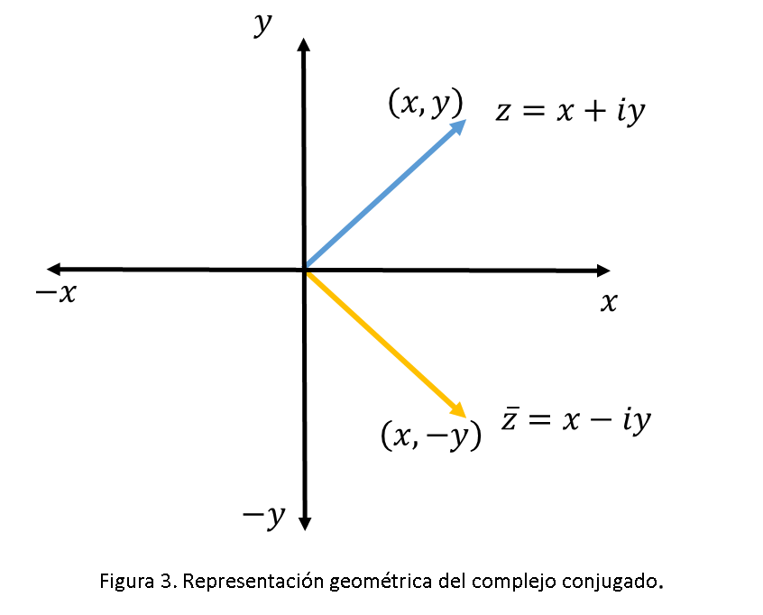

# transformada de laplace 
Cuando se pretende hacer una descomposición por fracciones parciales es importante tener en cuenta que tipo de factores están contenidos en el denominador, para este caso se abordaran otras dos posibilidades que aparecen recurrentemente a la hora de hacer la descomposición. Para el caso número dos, se establecerá como plantear las fracciones parciales, cuando al factorizar la expresión del denominador se obtiene raíces reales que son repetidas. Para el último caso, se establece un planteamiento totalmente diferente, ya que el numerador estará denotado como un sumado de dos términos donde uno de estos será coeficiente de la variable “s”, esta notación hará que sea muy probable que, a la hora de calcular la transformada inversa, la función coseno haga parte de esa expresión obtenida.
## 1.Descomposición en fracciones parciales 
>🔑La descomposición en fracciones parciales es un método matemático utilizado para descomponer una fracción racional (es decir, un cociente de dos polinomios) en una suma de fracciones más simples. Este proceso es fundamental en diversas áreas de las matemáticas, especialmente en el análisis de fracciones racionales, la integración de funciones racionales y el estudio de transformadas de Laplace en ingeniería. Este método se aplica bajo ciertas condiciones que permiten descomponer la fracción de manera única, y normalmente se utiliza cuando el grado del numerador es menor que el grado del denominador de no ser así, se realiza primero una división polinómica. en pro de reducir el grado.
### 1.1 Raices reales e iguales
Cuando el denominador de la fracción tiene raíces reales e iguales, es decir, el denominador tiene un factor cuadrado de una raíz real, la descomposición en fracciones parciales se plantean como se muestra acontinuacion, es importante tener en cuenta que el polinomio del numerador debe ser menor al del denominador.
$$F(s) = \frac{G(s)}{H(s)} = \frac{G(s)}{(s + p)^n}$$

$$F(s) = \frac{A}{(s + p)^1} + \frac{B}{(s + p)^2} + \cdots + \frac{n}{(s + p)^n}$$

### 1.2 Raices complejas conjugadas
Cuando el denominador de una fracción racional tiene raíces complejas conjugadas, la técnica de fracciones parciales se adapta para descomponerla en fracciones más simples. Este tipo de descomposición se usa cuando el denominador tiene factores cuadráticos que no pueden ser factorizados en términos de raíces reales, sino en términos de factores cuadráticos con coeficientes complejos.

$$F(s) = \frac{A_s + B}{s^2 + b_1 s + C_1} + \frac{C s + D}{s^2 + b_2 s + C_2} + \cdots + \frac{M s + N}{s^2 + b_n s + C_n}$$

$$F(s)=\frac{P(s)}{{(s}^2+b_1s+C_1)(s^2+b_2s+C_2)(s^2+b_ns+C_n)}$$

#### 1.2.1 Conjugado
>🔑El conjugado de un número complejo se obtiene cambiando el signo de la parte imaginaria del número, mientras que la parte real permanece igual. Si un número complejo se expresa como:

figura 1.representacion de complejo conjugado 

$$z = x + iy$$

     x  es la parte real,
     y  es la parte imaginaria, y
     i  es la unidad imaginarias
El conjugado de un número complejo se obtiene cambiando el signo de la parte imaginaria del número, mientras que la parte real permanece igual. es decir:
$$z = x - iy$$
 
 💡ejemplo 1

$$z = 4 + 7i$$

$$\overline{z} = 4 - 7i$$

#### 1.2.1 discriminante
La discriminante es un valor asociado a una ecuación cuadrática de la forma:
$$ax^2 + bx + c = 0$$
el discriminante de define como $$\Delta = b^2 - 4ac$$ donde a, b, y c son constantes. La discriminante se utiliza para determinar la naturaleza de las soluciones de esta ecuación cuadrática. la forma de interpretar el disciminante depende si este es menos, mayor o igual que 0.

- **Si \( d > 0 \)**: Raíces reales y diferentes.
- **Si \( d < 0 \)**: Raíces complejas conjugadas.
- **Si \( d = 0 \)**: Raíces reales e iguales.
  
 💡ejemplo 2

$$2x^2 - 5x + 3$$

$$\Delta = (-4)^2 - 4(2)(1) = 16 - 8 = 8$$

 se puede concluir que el polinomio contiene raices reales e iguales
## 📚Ejercicios
### 📚Ejercicio 1
$$\\frac{4s^2 - 8s + 1}{(s + 2)(s^2 - 2s + 3)}\$$
$$\\frac{A}{s + 2} + \frac{Bs + C}{s^2 - 2s + 3}\$$
$$\ A(s^2 - 2s + 3) + (Bs + C)(s + 2)\$$
$$\ As^2 - 2As + 3A + Bs^2 + 2Bs + Cs + 2C = 4s^2 - 8s + 1\$$
$$\\begin{cases}
A + B = 4 \\
-2A + 2B + C = -8 \\
3A + 2C = 1
\end{cases}\$$
$$\ B = 4 - A \$$
$$\ C = \frac{1 - 3A}{2} \$$
$$\ -2A + 2(4 - A) + \frac{1}{2} - \frac{3}{2} A = -8 \$$
$$\ -2A + 8 - 2A + \frac{1}{2} - \frac{3}{2} A = -8 \$$
$$\\frac{-11}{2} A = \frac{-33}{2}\$$
$$\ A = 3\$$
$$\ B = 1\$$
$$\ C = \frac{1 - 3(3)}{2}\$$
$$\ C = -4\$$
$$\\frac{3}{s + 2} + \frac{s - 4}{s^2 - 2s + 3}\$$
$$\mathcal{L}^{-1}\left[\frac{3}{s+2} - \frac{s-4}{(s-1)^2 + 2}\right]$$
$$3e^{-2t} - e^{t} \cos(\sqrt{2}t)$$

enunciado obtenido de open AI

### 📚Ejercicio 2

$$\\frac{4s^2 + 5s + 6}{(s + 3)(s^2 - 4s + 4)}\$$
$$\\frac{A}{s - 2} + \frac{B}{(s - 2)^2} + \frac{C}{s + 3}\$$
$$\ A(s - 2)(s + 3) + B(s + 3) + C(s - 2)^2\$$
$$\ A(s^2 + s - 6) + B(s + 3) + C(2s - 4s + 4)\$$
$$\ As^2 + As - 6A + Bs + 3B + 2Cs^2 - 4Cs + 4C\$$
$$\\begin{cases}
A + C = 4 \\
A + B - 4C = 5 \\
-6A + 3B + 4C = 6
\end{cases}\$$
$$\ A = 4 - C\$$
$$\ 4 - C + B - 4C = 5\$$
$$\ B = 5C + 1\$$
$$\ -6(4 - C) + 3(5C + 1) + 4C = 6\$$
$$\ -24 + 6C + 15C + 3 + 4C = 6\$$
$$\ 25C = 27\$$
$$\ C = \frac{27}{25}\$$
$$\ B = 5\left(\frac{27}{25}\right) + 1\$$
$$\ B = \frac{32}{5}\$$
$$\ A = 4 - \frac{27}{25}\$$
$$\ A = \frac{73}{25}\$$
$$\\frac{73}{25(s - 2)} + \frac{32}{5(s - 2)^2} + \frac{27}{25(s + 3)}\$$
$$\mathcal{L}^{-1}\left[\frac{73}{25(s-2)} + \frac{32}{5(s-2)^2} + \frac{27}{25(s+3)}\right]$$
$$\frac{73}{25} e^{2t} + \frac{32}{5} t e^{2t} + \frac{27}{25} e^{-3t}$$

enunciado obtenido de open AI

# Conclusiones
Es importante tener una estructura clara sobre conceptos alebraicos como factorizacion , evaulacion el discriminantes y  completar cuadrados ya que es esencial para poder identificar cual de los tres casos se puede aplicar en funcion de obtener expresiones que puedan relacionarse facil con la transformada inversa que se busca.
# Bibliografia
[ChatGPT] (https://openai.com/chatgpt)

