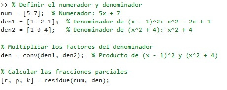
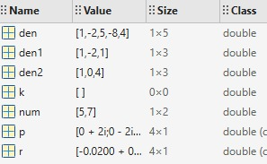
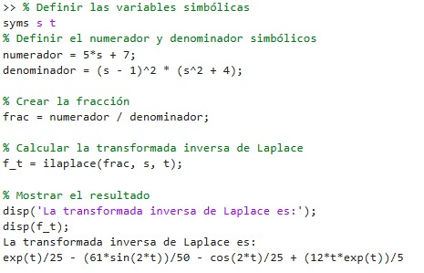
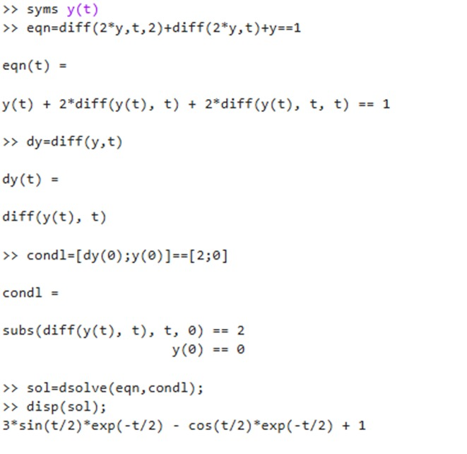
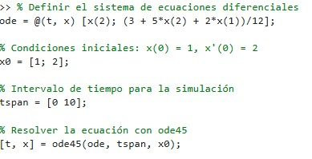
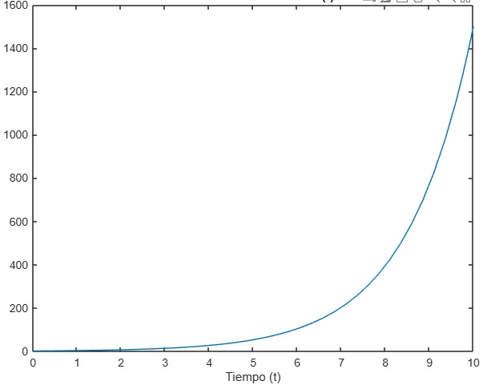
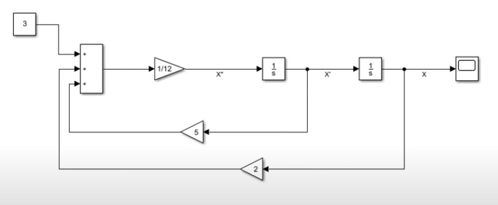
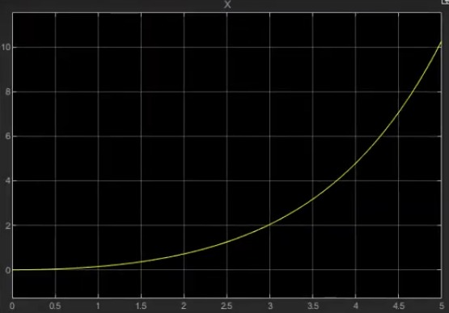

# Solución  de ecuaciones diferenciales 
La descomposición por fracciones parciales es una técnica que permite expresar una fracción racional como la suma de fracciones más simples, este proceso es muy importante ya que las expresiones obtenidas pueden ser relacionadas con transformadas inversas de Laplace, que en ultimas representan la solución a la ecuación diferencial que describe el comportamiento de un sistema dinámico. A pesar de que la descomposición por fracciones parciales es muy efectiva, sin embargo, cuando obtenemos la suma de más 3 fracciones simples, los métodos tradicionales pueden resultar tediosos ya que dar soluciones a sistemas de ecuaciones 4x4 en adelante, no suele ser común.    
Como solución a este problema se planteó el concepto de método simple, cuya ventaja se basa en que n necesito conocer el valor de los otros coeficientes para hallar uno. Este método al igual que al tradicional clasifica sus posibilidades en 3 casos es decir que en el denominador de las fracciones simples podemos encontrar; reales y diferentes, reales e iguales y raíces complejas conjugados.
## 1. Fracciones parciales método reducido  
para llevar a cabo la descomposicion en fracciones parciales es importante factorizar los polinomios del denominador en factores que contengan dos terminos, este metodo peopone una manera mas simple de hallar los numeradores a la hora de realizar la descomposicion, este metodo propone asignar y evaluar la variable "s" segun la fraccion simple que se pretende calcular.  
## 1.1 Raices reales y diferentes
para llevar a cabo la aplicacion se multiplicara toda las expresiones por el denominador de la variable que se pretende determinar, una vez hecho se evaluara la variable s en el valor que satisfaga la expresion del denominador.

$$ F(s) = \frac{G(s)}{H(s)} = \frac{G(s)}{(s + p_1)(s + p_2) \dots (s + p_n)}$$

$$\ A_K = \frac{G(s)}{H(s)} \cdot \frac{s + p_k}{s + p_k} \quad  \quad s = p_k\$$

## 1.2 Raices reales e iguales
cuando se obtiene raices reales e iguales en el denominador, se debe multiplicar y evaluar la variable s que satisfaga el binomio, sin embargo para este caso despues de calcular el primer valor, es necesario derivar la cantidad de veces que esten repetidas las raices.

$$F(s) = \frac{G(s)}{H(s)} = \frac{G(s)}{(s + p)^n}$$

$$ A_{K1} = \frac{G(s)}{H(s)} \cdot \frac{(s + p_k)^2}{(s + p_k)^2} \quad  \quad s = p_k $$

$$ B_{Kn} = \left[ \frac{G(s)}{H(s)} \cdot \frac{(s + p_k)^2}{(s + p_k)^2} \right]^{} \quad  \quad s = p_k $$

## 1.3 Raices complejas conjugadas

Este caso es muy similar al primero, se aplica cuando el polinomio del denominador es irreducible, se multiplicara toda las expresiones por el denominador de la variable que se pretende determinar, una vez hecho se evaluara la variable s en el valor que satisfaga la expresion del denominador. en este caso la expresion seran un numero complejo de la forma  $$x + iy$$

$$F(s)=\frac{P(s)}{{(s}^2+b_1s+C_1)(s^2+b_2s+C_2)(s^2+b_ns+C_n)}$$
$$\ A_K = \frac{G(s)}{H(s)} \cdot \frac{a s_k^2 + b s_k + c_k}{a s_k^2 + b s_k + c_k} \quad  \quad s = (x + i y)_k\$$

## 2.Soluciones Empleando matlab
>🔑 MATLAB es un lenguaje de programación y un entorno de desarrollo interactivo utilizado principalmente para el análisis numérico, la visualización de datos, el desarrollo de algoritmos,herramientas para trabajar con gráficos, simulaciones, procesamiento de señales, entre otras aplicaciones. gracias a sus multiples prestaciones es una herramienta muy popular en áreas como la ingeniería, las matemáticas, la física, la economía, la estadística y la inteligencia artificial.
### 2.1 Fracciones parciales
Para llevar a cabo la descomposición en fracciones parciales en Matlab, inicialmente se debe crear dos matrices; la primera contendrá los valores del numerados y la segunda los del denominador, una vez hecho este proceso se empleara una función llamada “residue”, que se encargara de toma los valores asignados para numerador y el denominador de un sistema de fracción racional y devuelve los coeficientes de las fracciones parciales.

💡ejemplo 1
 
$$\\frac{5x + 7}{(x - 1)^2 (x^2 + 4)} \$$

figura 1.Calculo en MATLAB

figura 2.Calculo en MATLAB

### 2.2 Transformada de Laplace
Cuando se pretende calcular la transformada de Laplace de una expresión, es necesario emplear la función syms quien generar las variables "s" y "t" permitiendo asi el cambio del dominio t al dominio s, una vez se ha incluido la función, se creará una variable que será igual a la función que se va a calcular. una vez creada la función se empleará el comando "ilplace" que instantáneamente presentará los valores esperados.

💡ejemplo 2
 
$$\\frac{5x + 7}{(x - 1)^2 (x^2 + 4)} \$$

figura 3.Calculo en MATLAB

### 2.3 Ecuaciones diferenciales 

Para calcular el  valor de una funcion en matlab, existen 3 metodos que funcionan de manera eficiente 

### 2.3.1 Metodo analitico

Para llevar a cabo el método analítico tambien se deberá integrar la función syms, posteriormente se creará una variable que contendrá la ecuacion que se pretende solucionar, una vez declarada esta variable se creara otra que contendrá los valores iníciales en una matriz. Para finalizar el proceso se emplara la función "dsolve" que integrara los valores dados y calculara  el valor de la función, para finalizar se empleara la función "disp" que mostrara el valor de la solución.

💡ejemplo 4

$$2x'' + 2x' + x = 1, \quad x'(0) = 2, \quad x(0) = 0$$

figura 4.Calculo en MATLAB

### 2.3.2 Metodo numerico ODE45

>🔑 La función ode45 resuelve ecuaciones diferenciales de primer orden utilizando un método de Runge-Kutta de orden 4 y 5 (de ahí el "45" en el nombre). Este es un método de paso variable, lo que significa que ajusta el tamaño del paso de integración durante la solución para obtener un buen equilibrio entre precisión y eficiencia computacional

💡ejemplo 4

$$ 12x'' - 5x' - 2x = 3  , \quad  x'(0)=2   , \quad  x(0)=1$$

figura 5.Calculo en MATLAB

figura 6.Grafica obtenida en MATLAB

### 2.3.3 Metodo numerico simulink

>🔑 Simulink es un entorno de simulación y diseño gráfico basado en bloques, que se utiliza junto con MATLAB para modelar, simular y analizar sistemas dinámicos, como sistemas de control, procesamiento de señales, comunicaciones, y muchos otros. Simulink permite a los usuarios diseñar modelos mediante una interfaz visual, arrastrando y conectando bloques, en lugar de escribir código de programación

💡ejemplo 5

$$ 12x'' - 5x' - 2x = 3$$

figura 7.Calculo en simulink

figura 8.Grafica obtenida en simulimk

## 📚 3. Ejercicios
### 📚3.1 Ejercicio 1
$$\frac{2s^3 + 5s^2 + 6s + 7}{(s-3)(s^2 + 2s + 2)}\  $$
$$\frac{A}{s-3} + \frac{Bs + C}{s^2 + 2s + 2}\$$
$$\ B s + C = \left[ \frac{2s^3 + 5s^2 + 6s + 7(s^2 + 2s + 2)}{(s - 3)(s^2 + 2s + 2)} \right] \quad \text{evaluado en} \quad s = -1+i \$$
$$\frac{2(-1+i)^3 + 5(-1+i)^2 + 6(-1+i) + 7}{(-1+i)-3} = B(-1+i) + C$$ 
$$\frac{5}{-4+i} = -B + Bi + C$$ 
$$\frac{-20}{17} - \frac{6i}{17} = -B + Bi + C$$ 
$$\frac{-20}{17} - \frac{6i}{17} = -B + Bi + C$$ 
$$\frac{-6i}{17} = Bi$$ 
$$ B = \frac{-6}{17}$$ 
$$ \frac{-20}{17} = -B + C$$ 
$$ \frac{-20}{17} = \frac{6}{17} + C$$ 
$$  C = \frac{-14}{17}$$
$$\ A = \left[ \frac{2s^3 + 5s^2 + 6s + 7}{s^2 + 2s + 2} \right] \$$
$$A = \frac{2(3)^3 + 5(3)^2 + 6(3) + 7}{(3)^2 + 2(3) + 2}$$
$$A = \frac{124}{17}$$
$$\frac{\frac{124}{17}}{s-3} + \frac{-\frac{6}{17}s - \frac{14}{17}}{s^2 + 2s + 2}$$
$$ \mathcal{L}^{-1} \left[ \frac{\frac{124}{17}}{s - 3} + \frac{-\frac{1}{17} s - \frac{14}{17}}{s^2 + 2s + 2} \right] $$
$$ \frac{124}{17} e^{3t} - \frac{1}{17} e^{-t} \cos(t) - \frac{14}{17} e^{-t} \sin(t)$$

### 📚3.2 Ejercicio 2
$$\\frac{6s^2 + 11s + 10}{(s + 2)(s^2 - 4s + 4)}\$$  
$$\\frac{A}{s - 2} + \frac{B}{(s - 2)^2} + \frac{C}{s + 2}\$$
$$\ A = \left[\frac{6s^2 + 11s + 10}{(s + 2)} \right] \quad \text{evaluado en} \quad s = 2 $$
$$\ A = \frac{6(2)^2 + 11(2) + 10}{2 + 2}\$$
$$\ A =14\$$
$$\ B = \left[ \frac{6s^2 + 11s + 10}{(s + 2)} \right] \frac{d}{ds} \quad \text{evaluado en} \quad s = 2\$$
$$\ B = \frac{(12s + 11)(s + 2) - (6s^2 + 11s + 10)}{(s + 2)^2} \Bigg|_{s = 2}\$$
$$\ B = \frac{(12(2) + 11)(2 + 2) - (6(2)^2 + 11(2) + 10)}{(2)^2 + 4(2) + 4} = \frac{21}{4}\$$
$$\ C = \left[ \frac{6s^2 + 11s + 10}{(s^2 - 4s + 4)} \right] \quad \text{evaluado en} \quad s = 2\$$
$$\ C = \frac{6(-2)^2 + 11(-2) + 10}{((-2)^2 - 4(-2) + 4)}\$$  
$$\ C= \frac{3}{4}\$$
$$ \frac{14}{s - 2} + \frac{\frac{21}{4}}{(s - 2)^2} + \frac{\frac{3}{4}}{s + 2}$$
$$ \mathcal{L}^{-1} \left[ \frac{14}{s - 2} + \frac{\frac{21}{4}}{(s - 2)^2} + \frac{\frac{3}{4}}{s + 2} \right] $$
$$ 14 e^{2t} + \frac{21}{4} t e^{2t} + \frac{3}{4} e^{-2t} $$

## Conclusiones
El metodo reducido es muy valioso a la hora que aparecen mas de 3 fracciones simples ya que plantear y solucionar un sistema 3x3 no suele ser tan complejo, sin embargo enfrentarse a sistema 4x4 en adelante resulta ser bastante tedioso y el margen de error puede aumentar, este metodo tiene una gran ventaja y es que para calcular una de las letras no es indispensable tener el valor de la otra.

## Bibliografia 

[ChatGPT] (https://openai.com/chatgpt)

[MATLAB] (https://matlab.mathworks.com/)
