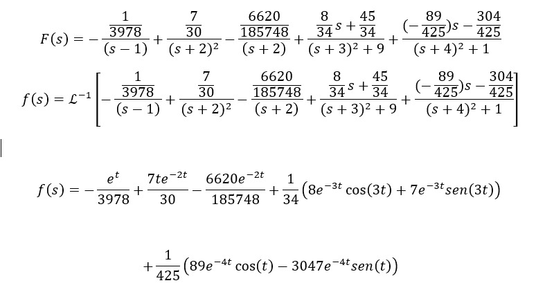

# Solucon de ecuaciones diferenciales 
en este caso se ha integrado las tecnicas vistas a la hora de haces la descomposicion en fracciones parciales 
## Ejemplo desarrollado en clase 
$$F(s) = \frac{2s - 3}{(s - 1)(s^2 + s - 2)(s^2 + 6s + 10)(s^2 + 8s + 17)}$$
$$2s - 3 = \frac{A}{s-1} + \frac{B}{(s+2)^2} + \frac{C}{s+2} + \frac{Ds + E}{s^2 + 6s + 10} + \frac{Fs + G}{s^2 + 8s + 17}$$
$$A = \left[ \frac{2s - 3}{(s - 1)(s + 2)^2 (s^2 + 6s + 10)(s^2 + 8s + 17)} (s - 1) \right]  \quad s = 1$$
$$ A = \frac{2(1) - 3}{(1 + 2)^2 \left( (1)^2 + 6(1) + 10 \right) \left( (1)^2 + 8(1) + 17 \right)}$$
$$ A=\frac{-1}{3978} \$$
$$ B = \left[ \frac{2s - 3}{(s - 1)(s + 2)^2 (s^2 + 6s + 10)(s^2 + 8s + 17)} (s + 2)^2 \right] \quad s = -2$$
$$ B = \frac{2(-2) - 3}{(-2 - 1)\left((-2)^2 + 6(-2) + 10\right)\left((-2)^2 + 8(-2) + 17\right)}$$
$$ B=\frac{7}{30} \$$
$$C = \left[ \frac{2s - 3}{(s - 1)(s^2 + 6s + 10)(s^2 + 8s + 17)} \right] \quad \frac{d}{ds}  \quad s = -2 $$

$$\frac{(2s - 3(5s^4 + 52s^3 - 138s^2 - 214s + 120)) - 2(s^5 + 13s^4 + 61s^3 - 107s^2 + 120s + 170)}{(s^5 + 13s^4 + 61s^3 - 107s^2 + 120s + 170)^2}$$

$$\frac{114s^5 - 447s^4 - 14s^3 + 642s^2 + 240s + 360 - 2s^5 - 26s^4 - 122s^3 + 214s^2 - 240s - 340}{s^{10} + 169s^8 + 3721s^6 - 11449s^4 + 14400s^2 + 28900}$$

$$C = \frac{112s^5 - 473s^4 - 136s^3 + 856s^2 + 20}{s^{10} + 169s^8 + 3721s^6 - 11449s^4 + 14400s^2 + 28900} \quad s = -2$$

$$C = \frac{112(-2)^5 - 473(-2)^4 - 136(-2)^3 + 856(-2)^2 + 20}{(-2)^{10} + 169(-2)^8 + 3721(-2)^6 - 11449(-2)^4 + 14400(-2)^2 + 28900}$$

$$ C=\frac{-6620}{185748} \$$

$$ Ds + E = \left[ \frac{s + 5}{(s - 1)(s + 2)^2 (s^2 + 6s + 10)(s^2 + 8s + 17)} (s^2 + 6s + 10) \right]  \quad s = -3 + i $$

$$ D(-3 + i) + E = \frac{2(-3 + i) - 3}{(-3 + i - 1)(-3 + i + 2)^2 \left( (-3 + i)^2 + 8(-3 + i) + 17 \right)} $$

$$ 3D+Di+E=15/34+8/34 i$$

$$ Di=\frac{8i}{34} \$$

$$ D=\frac{8}{34} \$$

$$ E = 3D + \frac{15}{34}$$

$$ E=\frac{45}{34} \$$

$$Fs + G = \left[ \frac{2s - 3}{(s - 1)(s + 2)^2 (s^2 + 6s + 10)(s^2 + 8s + 17)} (s^2 + 8s + 17) \right] \quad \text{at} \quad s = -4 + i$$

$$ F(-4 + i) + G = \frac{2(-4 + i) - 3}{(-3 + i - 1)(-4 + i + 2)^2 \left( (-4 + i)^2 + 6(-4 + i) + 10 \right)} $$

$$ -4F+Fi+G=-52/425+89/425 i $$

$$ Fi=\frac{89i}{425} \$$

$$ F=\frac{89}{425} \$$

$$G = -4 \left( \frac{89}{425} \right) + \frac{52}{425}$$

$$ G=\frac{304}{425} \$$

$$ F(s) = -\frac{1}{3978} \cdot \frac{1}{(s - 1)} + \frac{7}{30} \cdot \frac{1}{(s + 2)^2} - \frac{6620}{185748} \cdot \frac{1}{(s + 2)} + \frac{8}{34} s + \frac{45}{34} \cdot \frac{1}{(s + 3)^2 + 9} + \frac{-89}{425} s - \frac{304}{425} \cdot \frac{1}{(s + 4)^2 + 1} $$

